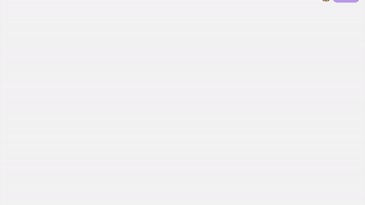

<h1 align="center">
  Ashley Jiang's Website
</h1>
<p align="center">
  The 3rd iteration of <a href="https://heyitsashleyhere.github.io/Portfolio-v3/" target="_blank">my personal website</a> built with <a href="https://reactjs.org/" target="_blank">React</a> and hosted with <a href="https://pages.github.com/" target="_blank">Github Pages</a>
</p>
<p align="center">
  Previous iterations:
  <a href="https://github.com/heyitsashleyhere/website-orientation-project" target="_blank">v1</a>,
  <a href="https://github.com/heyitsashleyhere/html-css-webProject" target="_blank">v2</a>,
</p>


## 🗒️ Overview

Built a simple personal website to showcase my growth as a web-developer from the start of my journey in 2021. This is my third iteration I build in 2022. Please feel free to reach out to my and give me feedbacks :) 



## 🛠 Installation & Set Up

1. Clone this repository

   ```sh
   git clone git@github.com:heyitsashleyhere/Portfolio-v3.git
   ```

2. Install dependencies

   ```sh
   npm install
   ```

3. Run the app

   ```sh
   npm start
   ```

## 💡 Inspirations
- [Brittany Chiang](https://github.com/bchiang7/v4)
- [Ivo Serra](https://github.com/ivoserra/portfolio)

## 📲 Contact

- GitHub [@heyitsashleyhere](https://github.com/heyitsashleyhere)
- Twitter [@ashhhleyhere](https://twitter.com/ashhhleyhere)
